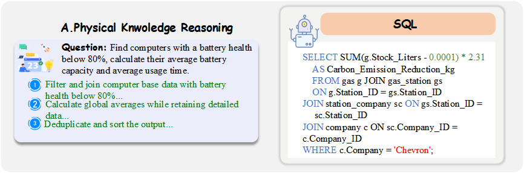
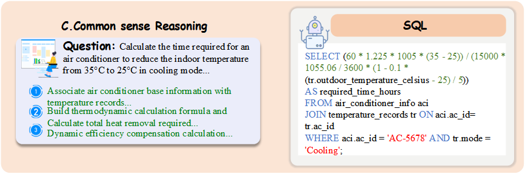
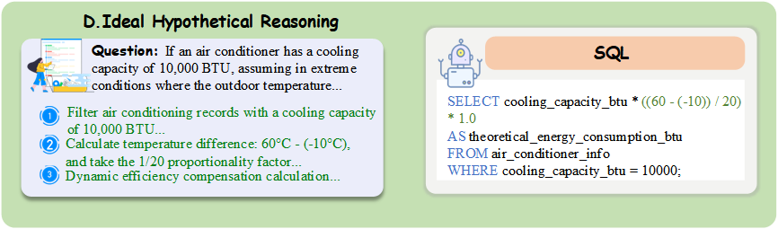

## LogicCat: A Chain-of-Thought Text-to-SQL Benchmark for Complex Reasoning

**📢 Accepted to AAAI 2026 (Poster)**  
**Paper:** [LogicCat: A Chain-of-Thought Text-to-SQL Benchmark for Complex Reasoning](https://arxiv.org/abs/2505.18744)  
**Leaderboard & Website:** [LogicCat Benchmark Leaderboard](https://ffunkytao.github.io/LogiccatBenchmark/)

---

### 🐱 Logo

<p align="center">
  
</p>

---

### 🧩 Overview

**LogicCat** is a **Chain-of-Thought multi-domain Text-to-SQL benchmark** designed to stress-test complex reasoning capabilities of large language models. It targets scenarios where SQL generation must be coupled with:

- **Physical knowledge reasoning**  
  <p align="center">
    
  </p>

- **Mathematical and logical computation**  
  <p align="center">
    
  </p>

- **Commonsense reasoning**  
  <p align="center">
    
  </p>

- **Ideal / hypothetical reasoning**  
  <p align="center">
    
  </p>

Compared with traditional Text-to-SQL benchmarks, LogicCat introduces **fine-grained CoT annotations** and **multi-step numerical reasoning**, making it closer to real enterprise analytics workloads and significantly more challenging than datasets such as Spider and BIRD ([paper](https://arxiv.org/abs/2505.18744), [leaderboard](https://ffunkytao.github.io/LogiccatBenchmark/)).

---

### 📰 News

- **Dec. 8, 2025:** LogicCat accepted to **AAAI 2026 (Poster)**.  
- **Oct. 1, 2025:** Public release of **LogicCat Benchmark** with 4,038 questions and 12,114 CoT steps.  
- **Feb. 5, 2026:** Release of **IESR: Efficient MCTS-Based Modular Reasoning for Text-to-SQL with Large Language Models** on LogicCat (see leaderboard page).

---

### 📦 Resources

- **Paper:** [arXiv:2505.18744](https://arxiv.org/abs/2505.18744)  
- **Leaderboard & Evaluation Instructions:** [LogicCat Benchmark Leaderboard](https://ffunkytao.github.io/LogiccatBenchmark/)  
- **Mini-Dev / Train / Dev / Test Splits:** see `MySQL/` and `Small500/` in this repository.  
- **Contact:** `taoliu01@zzu.edu.cn`, `xutao.mao@vanderbilt.edu`, `iehyzan@zzu.edu.cn`

---

### 🔍 Benchmark at a Glance

- **Questions:** 4,038 English natural language questions  
- **Chain-of-thought steps:** 12,114 fine-grained reasoning steps  
- **Databases:** 45 heterogeneous databases across **7 categories** and multiple vertical domains  
- **Reasoning types:** Physical, Mathematical, Commonsense, Hypothetical (questions can belong to multiple types)  
- **Target task:** Generate **accurate, executable SQL** and **faithful reasoning traces**.

#### Database Coverage

LogicCat organizes its 45 databases into seven high-level categories:

| **Category** | **Domains (examples)** | **Coverage** |
|-------------|------------------------|--------------|
| **Consumer IoT** | Computer, iPad, Phone, Phone market, Air conditioner, Earphone, Television, Mouse, Printer, Watch, Water heater, Rice cooker | 31.12% |
| **Transportation** | Car, Car engine, Bike, Yacht, Ship, Submarine, Railway, Railway station, AirCraft, Roller coaster, New energy vehicles, Electric scooter | 26.06% |
| **Industry** | Generators, Wind turbine, Gas, Water pump, Smart Home (SmartHomeDB), Energy Management (EnergyManagementDB) | 10.1% |
| **Infrastructure** | Hospital, School, Concert, Exercise club, Contract, Architect, Population | 10.1% |
| **Services** | Equipment Management (EquipmentManagementDB), Alarm System (AlarmSystem), Data Collector (DataCollector) | 10.1% |
| **Research** | PhysicsLabDB, WaterQualityMonitor, RainGauge | 9.06% |
| **Agriculture** | Lawn mower | 3.35% |

**Database statistics:**
- **Average tables / DB:** 5.71  
- **Average columns / DB:** 61.07  
- **Total arithmetic operators:** 17,869  
- **Average table joins / query:** 3.1  

#### Reasoning Types

| **Reasoning Type** | **Count** | **Percentage** | **Description** |
|-------------------|-----------|----------------|-----------------|
| Physical Knowledge | 1,142 | 35.0% | Physics formulas, device properties, unit conversions, constraints |
| Mathematical Logic | 1,087 | 78.0% | Arithmetic operations, temporal logic, branching conditions |
| Common Sense | 1,062 | 59.0% | Everyday knowledge, implicit inferences, qualitative reasoning |
| Ideal Hypothetical | 1,073 | 25.0% | Counterfactual or idealized “what-if” scenarios |

#### Difficulty Levels

| **Difficulty** | **SQL Tokens** | **Arithmetic Ops** | **Count** | **Percentage** |
|---------------|----------------|-------------------|-----------|----------------|
| Easy | < 30 | < 5 | 1,443 | 35.73% |
| Medium | 30–70 | 5–7 | 1,897 | 46.97% |
| Hard | ≥ 70 | ≥ 7 | 698 | 17.28% |

---

### 🗂️ Dataset Structure

The released files are organized as follows:

```text
LogicCat/
├── MySQL/
│   ├── database/              # 45 MySQL SQL schema files
│   │   ├── air_conditioner.sql
│   │   ├── AirCraft.sql
│   │   ├── phone.sql
│   │   └── ...
│   ├── train.json             # Full training set (NLQ + SQL + CoT)
│   ├── dev.json               # Dev set
│   ├── test.json              # Test set (SQL hidden for public track)
│   ├── table_train.json       # Database schema information for train
│   ├── table_test.json        # Database schema information for dev/test
│
└── Small500/                  # 500-sample lightweight subset
    ├── mysql_gold_500.sql     # MySQL gold SQL scripts (500 samples)
    ├── mysql_tiny_500.json    # MySQL question–SQL subset (500 samples)
```

#### Data Format

Each example (illustrative) contains:

```json
{
  "db_id": "database_name",
  "question": "Natural language question",
  "sql": "Ground truth SQL query",
  "difficulty": "easy|medium|hard",
  "reasoning_types": ["Physical", "Mathematical", "Commonsense", "Hypothetical"],
  "chain_of_thought": [
    "Step 1: ...",
    "Step 2: ...",
    "Step 3: ..."
  ],
  "formulas": ["formula1", "formula2"],
  "expected_result": "..."
}
```

---

### 🚀 Getting Started

#### Environment

```bash
# Python 3.11+
pip install mysql-connector-python   # MySQL 8.0+

# (Optional, usually bundled with Python)
# sqlite3

# Common utilities
pip install pandas numpy
```

#### Load Question–SQL Pairs

```python
import json

with open("MySQL/train.json", "r", encoding="utf-8") as f:
    train_data = json.load(f)

with open("MySQL/table_train.json", "r", encoding="utf-8") as f:
    train_schemas = json.load(f)

print(f"Train questions: {len(train_data)}")
print(f"Train databases: {len(train_schemas)}")
```

#### Build a MySQL Database from Schema

```python
import mysql.connector

schema_path = "MySQL/database/phone.sql"
with open(schema_path, "r", encoding="utf-8") as f:
    schema_sql = f.read()

conn = mysql.connector.connect(
    host="localhost",
    user="your_username",
    password="your_password",
)
cursor = conn.cursor()
cursor.execute("CREATE DATABASE IF NOT EXISTS phone_db")
cursor.execute("USE phone_db")

for statement in schema_sql.split(";"):
    if statement.strip():
        cursor.execute(statement)

conn.commit()
cursor.close()
conn.close()
```

---

### 🧪 Evaluation & Leaderboard

- **Official evaluation protocol, submission format, and latest results** are maintained on the **LogicCat Leaderboard page**:  
  👉 [LogicCat Benchmark Leaderboard](https://ffunkytao.github.io/LogiccatBenchmark/)

- The leaderboard reports **Execution Accuracy (EX)** and **Exact Match (EM)** across overall, difficulty levels, and reasoning types.  
- Human performance (data engineers + DB students) reaches **95.05% EX**, while current best models remain far below this ceiling ([details on the leaderboard site](https://ffunkytao.github.io/LogiccatBenchmark/)).
- The LogicCat leaderboard is the **officially certified 2025 benchmark track** for complex chain-of-thought Text-to-SQL reasoning on this dataset.

If you would like your model to be evaluated on the **hidden test set**, please follow the submission guidelines on the leaderboard page and contact the authors listed there.

---

### 📖 Citation

If you use LogicCat in your research, please cite:

```bibtex
@misc{liu2025logiccatchainofthoughttexttosqlbenchmark,
  title={LogicCat: A Chain-of-Thought Text-to-SQL Benchmark for Complex Reasoning},
  author={Tao Liu and Xutao Mao and Hongying Zan and Dixuan Zhang and Yifan Li and Haixin Liu and Lulu Kong and Jiaming Hou and Rui Li and YunLong Li and aoze zheng and Zhiqiang Zhang and Luo Zhewei and Kunli Zhang and Min Peng},
  year={2025},
  eprint={2505.18744},
  archivePrefix={arXiv},
  primaryClass={cs.CL},
  url={https://arxiv.org/abs/2505.18744}
}
```

---

### 📄 License

This dataset is released under the **MIT License** (see `LICENSE`). Please respect the terms of use and cite appropriately when using or redistributing the data.

---

### 🙏 Acknowledgments

LogicCat is developed by researchers from **Zhengzhou University**, **Vanderbilt University**, and **Wuhan University**.  
We thank the doctoral students and senior engineers who contributed extensive effort to data design, annotation, and validation.

---

**Last Updated:** Mar 9, 2026

